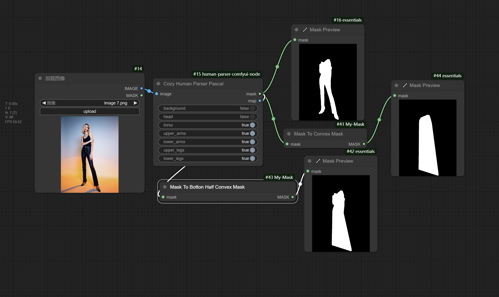

## Description

Some nodes for processing masks, currently including nodes that fill in the concave parts of existing masks with convex hulls.

## Mask Nodes examples

MaskToConvexMask is responsible for filling in all concave areas of an existing mask with a convex hull.

MaskToBottomHalfConvexMask is responsible for filling in the concave areas of the lower half of an existing mask with a convex hull.

